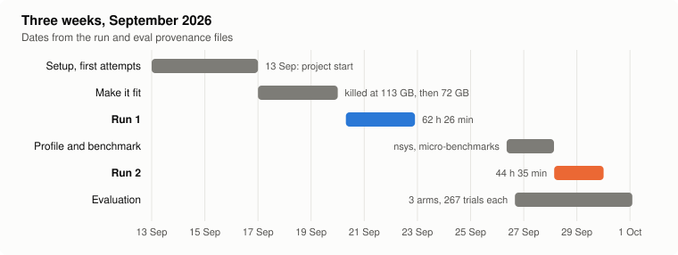
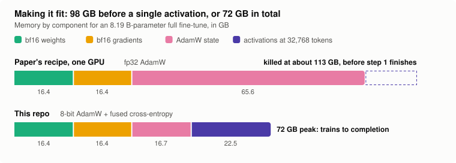
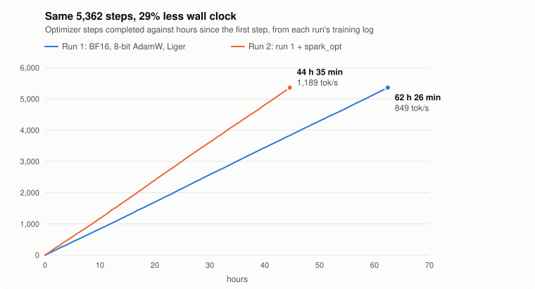
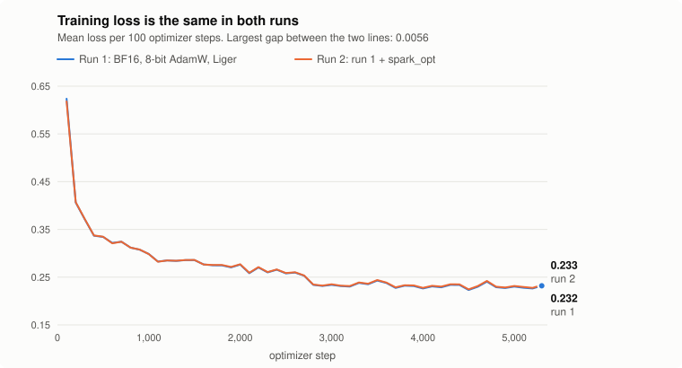
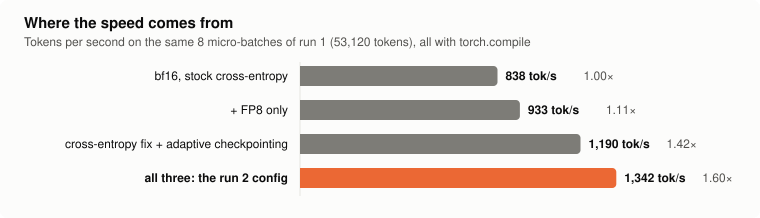

# Full fine-tuning of Qwen3-8B on one NVIDIA DGX Spark

[](https://wandb.ai/vittorio-rossi-epfl/open_instruct_internal/runs/a3zwdgg5)
[](https://wandb.ai/vittorio-rossi-epfl/open_instruct_internal/runs/bgewsxq3)
[](https://huggingface.co/vittorino/qwen3-8b-tmax-sft-run2)
[](https://huggingface.co/datasets/vittorino/tmax-sft-cleaned)
[](https://arxiv.org/abs/2606.23321)
[](LICENSE)

A full fine-tune of an 8 B-parameter model at 32,768-token sequences, on a single
desktop machine with 128 GB of memory shared between CPU and GPU.

Two objectives: make it fit, and make it faster (at constant loss).

The recipe is the SFT half of TMAX ([arXiv:2606.23321](https://arxiv.org/abs/2606.23321)),
run with the authors' own code ([`hamishivi/tmax`](https://github.com/hamishivi/tmax),
a fork of open-instruct). We overlay that code via a patch,
module, launcher, and the measurements.



## Make it fit



How the numbers were measured, and the kill loop every run on this machine needs:
[`docs/spark-memory-guardrail.md`](docs/spark-memory-guardrail.md).

## Make it faster

| | Run 1: make it fit | Run 2: make it fast |
|---|---|---|
| Throughput | 849 tok/s | 1,189 tok/s (**+40%**) |
| Wall clock, 5,362 steps | 62 h 26 min | 44 h 35 min (**−29%**) |
| Mean training loss | 0.2689 | 0.2696 |
| Live curves | [W&B run 1](https://wandb.ai/vittorio-rossi-epfl/open_instruct_internal/runs/a3zwdgg5) | [W&B run 2](https://wandb.ai/vittorio-rossi-epfl/open_instruct_internal/runs/bgewsxq3) |

<table>
  <tr>
    <td></td>
    <td></td>
  </tr>
</table>



Profiling run 1 showed 9% of GPU time rebuilding the output layer's gradient about
30 times per sequence, and every layer being recomputed on every sequence. Fixing
those two gives 1.42×; FP8 takes it to 1.60×, and shifts the first-step loss by 3%.
The file behind each number: [`docs/results.md`](docs/results.md).

## What this does not show

**Model quality is not reproduced.** The paper reports 1.1% → 6.0% on
Terminal-Bench for this fine-tune. Here: 1.1% untrained, 1.5% run 1, 3.4% run 2,
with a third of the fine-tuned model's trials ending in a timeout. Candidate causes
and the test for each: [results, section 7](docs/results.md#7-evaluation-work-in-progress).

One machine only: nothing here is evidence about multi-GPU or multi-node training.

## What is in the repo

| Path | What |
|---|---|
| `spark_opt.py`, `configs/spark_opt_qwen3_8b.yaml` | the run 2 throughput changes, applied to a loaded model |
| `patches/finetune-spark.patch` | the changes to upstream `finetune.py`: 8-bit optimizer on a full fine-tune, the `spark_opt` hook, an attention-detection fix for ARM |
| `scripts/sft_qwen3_8b_train_it.sh` | launcher: checks the patch and environment, records provenance, runs the fine-tune |
| `scripts/bench_spark_opt.py` | one-minute throughput and correctness check of a `spark_opt` config |
| `scripts/clean_dataset.py` | rebuilds the training dataset from `allenai/tmax-sft` |
| `scripts/plot_runs.py` | draws the figures above |
| `scripts/eval_*.sh`, `scripts/patch_harbor.py`, `patches/vanillux2-docker-timeout.patch`, `patches/tmax-harness-config/` | Terminal-Bench evaluation on the Spark |
| `scripts/failure_mode_bucketing.py` | groups eval trials by why they ended |
| `docs/results.md` | all measurements |
| `docs/spark-memory-guardrail.md` | the memory model, and the kill loop every run on this machine needs |
| `docs/environment.md` | aarch64 / CUDA 13 setup and pitfalls |
| `evidence/` | per-step training data, benchmark results, kernel profile summary, eval job results |

## Reproducing a run

On the Spark, from a clone of this repo:

```bash
git clone https://github.com/hamishivi/tmax.git ~/tmax
git -C ~/tmax checkout 6d3d606c
git -C ~/tmax apply "$PWD/patches/finetune-spark.patch"
```

Install the environment as described in [`docs/environment.md`](docs/environment.md),
start the memory guardrail from [`docs/spark-memory-guardrail.md`](docs/spark-memory-guardrail.md)
in a second shell, then:

```bash
# run 1
EXP_NAME=sft_qwen3_8b_run1 bash scripts/sft_qwen3_8b_train_it.sh

# run 2
SPARK_OPT_CONFIG=configs/spark_opt_qwen3_8b.yaml \
  EXP_NAME=sft_qwen3_8b_run2 bash scripts/sft_qwen3_8b_train_it.sh
```

## Credits

A two-person project by Vittorio Rossi and Alfredo Ceci, September 2026, on
Alfredo's DGX Spark. The training-side work in this repo (memory model, patch,
`spark_opt`, benchmarks, the two runs) is Vittorio's. The evaluation harness setup,
the eval launch scripts and the two eval patches are Alfredo's.

Coding agents were used throughout to write and run code. The measurements were
run on the hardware, and the numbers on this page are read from the files in
`evidence/`.

Built on [`hamishivi/tmax`](https://github.com/hamishivi/tmax) and
[open-instruct](https://github.com/allenai/open-instruct) (Apache-2.0),
[Liger Kernel](https://github.com/linkedin/Liger-Kernel),
[torchao](https://github.com/pytorch/ao) and
[bitsandbytes](https://github.com/bitsandbytes-foundation/bitsandbytes).

Licensed under Apache-2.0. See [`NOTICE`](NOTICE) for what derives from upstream.
